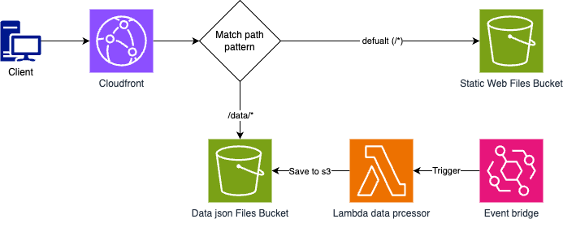

# webstack

Full stack web project.

## setup

**One time** setup with `just import-repo` to import the repo into the terraform state.

Apply github settings and create github `ci` environment seeded with required variables and branch controls.

```sh
just setup-repo
just init dev
judt init prod
```

Example plan command - `just tg dev aws/jobs plan`

**_WARNING_**
Terragrunt will create the s3 state bucket the first time this is done - this should only happen _ONCE_.

```sh
Remote state S3 bucket your-state-bucket-name-tfstate does not exist or you dont have permissions to access it. Would you like Terragrunt to create it? (y/n) y
```

#### required installs

```sh
brew install terragrunt
brew install terraform
brew install just
brew install awscli
brew install gh
brew install node
npm install -g prettier
```

